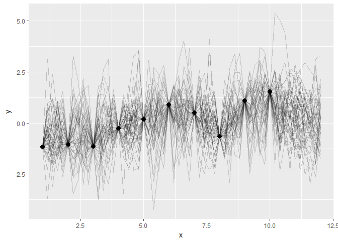
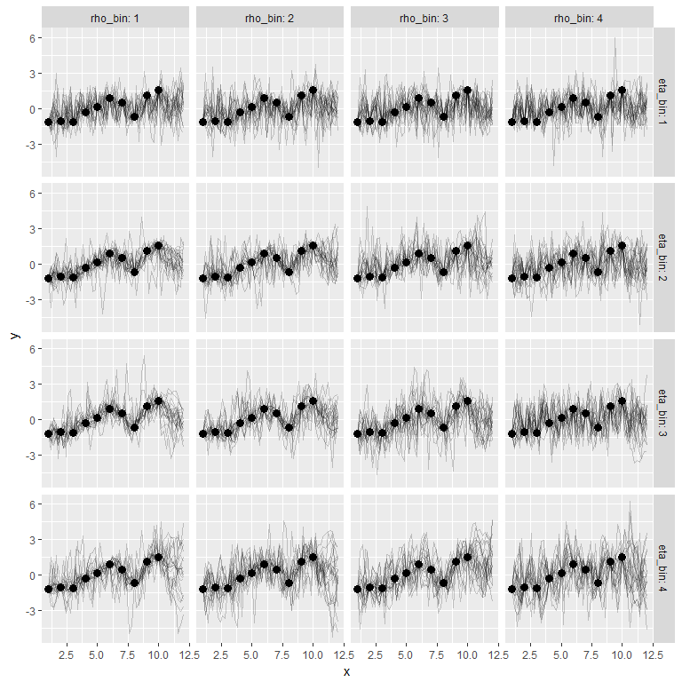

# Playing with Gaussian processes


```r
library(rstan)
#> Loading required package: ggplot2
#> Loading required package: StanHeaders
#> rstan (Version 2.15.1, packaged: 2017-04-19 05:03:57 UTC, GitRev: 2e1f913d3ca3)
#> For execution on a local, multicore CPU with excess RAM we recommend calling
#> rstan_options(auto_write = TRUE)
#> options(mc.cores = parallel::detectCores())
```

The plot seem too wiggly. I am not sure if the Stan code is 100% correct. Or
whether the problem is the sigma term.


```r
# Compile the model
m_exe <- stan_model("./gp-fit.stan")
```


```r
m_exe
#> S4 class stanmodel 'gp-fit' coded as follows:
#> # Estimate from Gaussian Process from data
#> data {
#>   # x1 and y1 are the observed data... the points you would see on a plot
#>   int<lower=1> N1;
#>   vector[N1] x1;
#>   vector[N1] y1;
#> 
#>   # we predict values along x2. these would be the x values in between points.
#>   int<lower=1> N2;
#>   vector[N2] x2;
#> }
#> transformed data {
#>   int<lower=1> N;
#>   vector[N1 + N2] x;
#>   vector[N1 + N2] mu;
#>   N = N1 + N2;
#>   for (n in 1:N1) x[n] = x1[n];
#>   for (n in 1:N2) x[N1 + n] = x2[n];
#>   # fixed mean to 0
#>   for (i in 1:N) mu[i] = 0;
#> }
#> parameters {
#>   real<lower=0> eta_sq;
#>   real<lower=0> inv_rho_sq;
#>   real<lower=0> sigma_sq;
#>   vector[N2] y2;
#> }
#> transformed parameters {
#>   real<lower=0> rho_sq;
#>   rho_sq = inv(inv_rho_sq);
#> }
#> model {
#>   matrix[N, N] Sigma;
#>   vector[N] y;
#> 
#>   eta_sq ~ normal(0, 5);
#>   inv_rho_sq ~ normal(0, 1);
#>   sigma_sq ~ normal(0, 5);
#> 
#>   // off-diagonal elements
#>   for (i in 1:(N-1)) {
#>     for (j in (i+1):N) {
#>       Sigma[i, j] = eta_sq * exp(-rho_sq * pow(x[i] - x[j], 2));
#>       Sigma[j, i] = Sigma[i, j];
#>     }
#>   }
#> 
#>   // diagonal elements
#>   for (k in 1:N)
#>     Sigma[k, k] = eta_sq + sigma_sq;
#> 
#>   for (n in 1:N1) y[n] = y1[n];
#>   for (n in 1:N2) y[N1 + n] = y2[n];
#> 
#>   y ~ multi_normal(mu, Sigma);
#> }
#> 
```


```r
# Stan data
m_data <- list(
  N1 = 10, 
  x1 = 1:10, 
  y1 = as.vector(scale(lme4::sleepstudy$Reaction[1:10])))

# x values over which to predict new ys
new_xs <- seq(1, 12, by = .2)

# Remove the xs that have a known y
m_data$x2 <- new_xs[!(new_xs %in% m_data$x1)]
m_data$N2 <- length(m_data$x2)
```


```r
m_fit <- sampling(m_exe, m_data, chains = 1)
#> 
#> SAMPLING FOR MODEL 'gp-fit' NOW (CHAIN 1).
#> 
#> Gradient evaluation took 0.001 seconds
#> 1000 transitions using 10 leapfrog steps per transition would take 10 seconds.
#> Adjust your expectations accordingly!
#> 
#> 
#> Iteration:    1 / 2000 [  0%]  (Warmup)
#> Iteration:  200 / 2000 [ 10%]  (Warmup)
#> Iteration:  400 / 2000 [ 20%]  (Warmup)
#> Iteration:  600 / 2000 [ 30%]  (Warmup)
#> Iteration:  800 / 2000 [ 40%]  (Warmup)
#> Iteration: 1000 / 2000 [ 50%]  (Warmup)
#> Iteration: 1001 / 2000 [ 50%]  (Sampling)
#> Iteration: 1200 / 2000 [ 60%]  (Sampling)
#> Iteration: 1400 / 2000 [ 70%]  (Sampling)
#> Iteration: 1600 / 2000 [ 80%]  (Sampling)
#> Iteration: 1800 / 2000 [ 90%]  (Sampling)
#> Iteration: 2000 / 2000 [100%]  (Sampling)
#> 
#>  Elapsed Time: 8.868 seconds (Warm-up)
#>                7.332 seconds (Sampling)
#>                16.2 seconds (Total)
m_fit
#> Inference for Stan model: gp-fit.
#> 1 chains, each with iter=2000; warmup=1000; thin=1; 
#> post-warmup draws per chain=1000, total post-warmup draws=1000.
#> 
#>              mean se_mean    sd   2.5%    25%    50%   75% 97.5% n_eff Rhat
#> eta_sq       1.02    0.07  0.92   0.04   0.44   0.74  1.33  3.48   195 1.02
#> inv_rho_sq   1.07    0.05  0.69   0.06   0.51   1.01  1.51  2.53   172 1.00
#> sigma_sq     0.66    0.11  0.64   0.04   0.17   0.46  0.93  2.43    31 1.01
#> y2[1]       -0.73    0.03  1.04  -2.77  -1.37  -0.80 -0.14  1.52  1000 1.01
#> y2[2]       -0.71    0.03  1.05  -2.75  -1.35  -0.78 -0.10  1.57  1000 1.01
#> y2[3]       -0.71    0.04  1.04  -2.61  -1.33  -0.79 -0.10  1.54   591 1.01
#> y2[4]       -0.73    0.03  1.05  -2.59  -1.36  -0.85 -0.17  1.54  1000 1.01
#> y2[5]       -0.70    0.03  1.10  -2.69  -1.39  -0.83 -0.14  1.71  1000 1.00
#> y2[6]       -0.64    0.03  1.04  -2.55  -1.31  -0.73  0.05  1.58  1000 1.01
#> y2[7]       -0.68    0.05  1.07  -2.55  -1.37  -0.77 -0.05  1.73   422 1.01
#> y2[8]       -0.68    0.07  1.03  -2.64  -1.28  -0.78 -0.12  1.65   247 1.01
#> y2[9]       -0.59    0.03  1.07  -2.67  -1.21  -0.69 -0.01  1.81  1000 1.00
#> y2[10]      -0.41    0.06  1.07  -2.40  -1.05  -0.49  0.16  2.05   308 1.00
#> y2[11]      -0.29    0.05  1.03  -2.23  -0.91  -0.37  0.30  2.11   509 1.00
#> y2[12]      -0.24    0.03  0.99  -2.13  -0.84  -0.33  0.25  1.97  1000 1.00
#> y2[13]      -0.11    0.03  0.96  -2.11  -0.65  -0.16  0.42  1.85  1000 1.00
#> y2[14]      -0.02    0.03  1.05  -2.25  -0.60  -0.05  0.55  2.20  1000 1.00
#> y2[15]       0.05    0.03  1.00  -2.17  -0.49   0.07  0.59  2.08  1000 1.00
#> y2[16]       0.09    0.03  1.03  -2.11  -0.42   0.09  0.65  2.18  1000 1.00
#> y2[17]       0.22    0.03  1.01  -1.89  -0.34   0.26  0.76  2.28  1000 1.00
#> y2[18]       0.30    0.03  0.99  -1.72  -0.24   0.30  0.82  2.42  1000 1.00
#> y2[19]       0.41    0.03  1.05  -1.74  -0.18   0.44  1.02  2.54  1000 1.01
#> y2[20]       0.46    0.03  1.02  -1.80  -0.09   0.56  1.04  2.48  1000 1.01
#> y2[21]       0.55    0.03  1.04  -1.95  -0.02   0.65  1.17  2.45  1000 1.00
#> y2[22]       0.49    0.03  1.05  -1.82  -0.10   0.56  1.15  2.49  1000 1.01
#> y2[23]       0.45    0.03  0.99  -1.57  -0.11   0.51  1.04  2.48  1000 1.00
#> y2[24]       0.36    0.03  1.03  -1.76  -0.15   0.46  0.94  2.27  1000 1.01
#> y2[25]       0.14    0.03  0.96  -1.89  -0.36   0.13  0.70  2.10  1000 1.00
#> y2[26]      -0.02    0.03  1.00  -1.99  -0.54  -0.11  0.47  2.32  1000 1.00
#> y2[27]      -0.15    0.04  1.01  -2.04  -0.70  -0.23  0.36  1.99   737 1.00
#> y2[28]      -0.27    0.03  0.95  -2.07  -0.81  -0.30  0.25  1.76   889 1.00
#> y2[29]      -0.22    0.03  0.96  -2.25  -0.75  -0.25  0.33  1.60  1000 1.01
#> y2[30]       0.01    0.03  1.07  -2.37  -0.59  -0.04  0.55  2.42  1000 1.00
#> y2[31]       0.20    0.03  1.04  -2.07  -0.36   0.24  0.73  2.35  1000 1.00
#> y2[32]       0.44    0.03  1.06  -1.89  -0.08   0.49  1.02  2.47  1000 1.00
#> y2[33]       0.76    0.06  1.07  -1.41   0.16   0.86  1.43  2.68   339 1.00
#> y2[34]       0.82    0.08  1.18  -1.85   0.15   0.96  1.58  2.85   221 1.01
#> y2[35]       0.92    0.07  1.16  -1.50   0.20   1.06  1.67  2.99   242 1.00
#> y2[36]       0.97    0.07  1.07  -1.28   0.31   1.15  1.65  2.92   222 1.01
#> y2[37]       0.80    0.04  1.13  -1.63   0.14   0.87  1.48  2.92  1000 1.01
#> y2[38]       0.66    0.05  1.14  -1.65  -0.04   0.69  1.31  2.89   457 1.01
#> y2[39]       0.51    0.06  1.22  -1.88  -0.22   0.55  1.25  2.96   394 1.01
#> y2[40]       0.33    0.06  1.25  -2.32  -0.43   0.36  1.08  2.96   435 1.00
#> y2[41]       0.25    0.06  1.24  -2.37  -0.52   0.27  1.04  2.82   440 1.00
#> y2[42]       0.13    0.06  1.31  -2.55  -0.63   0.15  0.94  2.72   419 1.00
#> y2[43]       0.07    0.06  1.35  -2.63  -0.70   0.11  0.85  2.92   486 1.00
#> y2[44]       0.06    0.06  1.32  -2.71  -0.68   0.05  0.82  2.83   485 1.00
#> y2[45]       0.07    0.06  1.25  -2.31  -0.67   0.07  0.76  2.68   504 1.00
#> y2[46]       0.06    0.04  1.34  -2.67  -0.71   0.07  0.81  2.87  1000 1.00
#> rho_sq       4.68    1.83 28.55   0.39   0.66   0.99  1.96 17.91   245 1.01
#> lp__       -18.70    5.33 22.33 -56.30 -35.91 -20.69 -2.27 25.64    18 1.06
#> 
#> Samples were drawn using NUTS(diag_e) at Thu Jun 15 10:35:22 2017.
#> For each parameter, n_eff is a crude measure of effective sample size,
#> and Rhat is the potential scale reduction factor on split chains (at 
#> convergence, Rhat=1).
```


```r
library(dplyr, warn.conflicts = FALSE)
library(ggplot2)

# Create a dataframe of x values and the names of inferred y values
inferred_data_names <- tibble(
  x = m_data$x2, 
  point = sprintf("y2[%s]", seq_along(x)))

# Get the posterior samples into a long format and add the y values
posterior_inferred <- as.data.frame(m_fit) %>% 
  tibble::as_tibble() %>% 
  select(starts_with("y2"), eta_sq, rho_sq, sigma_sq) %>% 
  tibble::rowid_to_column("draw") %>% 
  tidyr::gather(point, value, -draw, -eta_sq, -rho_sq, -sigma_sq) %>% 
  left_join(inferred_data_names) %>% 
  select(draw, eta_sq, rho_sq, sigma_sq, x, y = value)
#> Joining, by = "point"

df_observed <- tibble(x = m_data$x1, y = m_data$y1)

# dataframe of process parameters
gp_parameters <- posterior_inferred %>% 
  distinct(draw, eta_sq, rho_sq, sigma_sq)

# Create a "posterior" for the observed values
posterior_observed <- df_observed %>% 
  tidyr::expand(tidyr::nesting(x, y), draw = 1:1000) %>% 
  left_join(gp_parameters, by = "draw")

posterior <- bind_rows(posterior_inferred, posterior_observed)
to_plot <- sample(unique(posterior$draw), 50)
posterior_plot <- posterior %>% 
  filter(draw %in% to_plot)

ggplot(df_observed) + 
  aes(x = x, y = y) + 
  geom_line(aes(group = draw), data = posterior_plot, alpha = .2) + 
  geom_point(size = 3) 
```

<!-- -->

Plot the process at different eta and rho quartiles


```r
grid_definition <- posterior %>% 
  distinct(draw, eta_sq, rho_sq) %>% 
  mutate(eta_bin = ntile(eta_sq, 4),
         rho_bin = ntile(rho_sq, 4)) %>% 
  group_by(eta_bin, rho_bin) %>% 
  sample_n(20) %>% 
  ungroup()

grid_data <- posterior %>% 
  inner_join(grid_definition)
#> Joining, by = c("draw", "eta_sq", "rho_sq")

ggplot(data = grid_data) + 
  aes(x = x, y = y) + 
  geom_line(aes(group = draw), alpha = .2) + 
  geom_point(size = 3, data = df_observed) + 
  facet_grid(eta_bin ~ rho_bin, labeller = label_both)
```

<!-- -->

