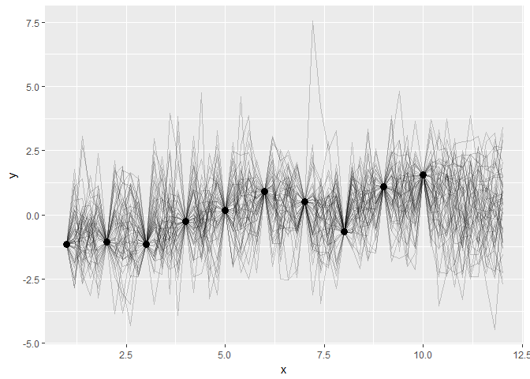
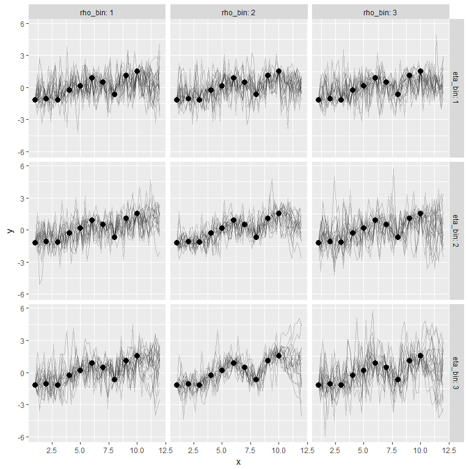
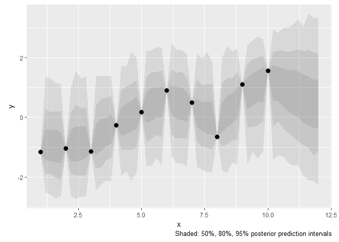
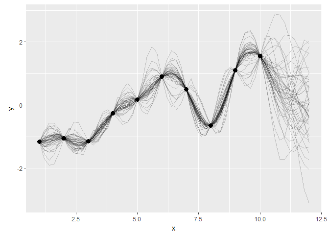
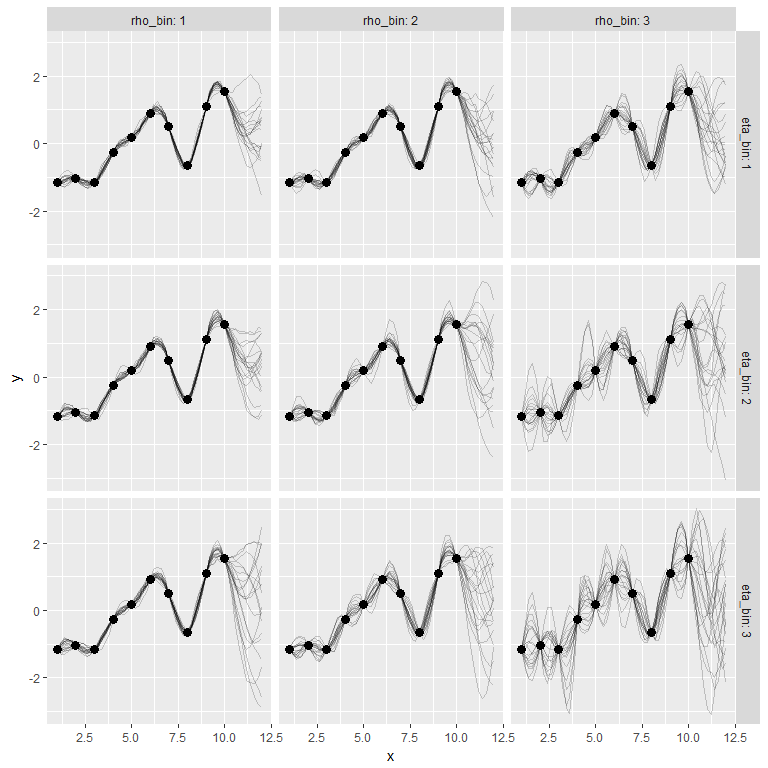

# Playing with Gaussian processes


```r
library(rstan)
#> Loading required package: ggplot2
#> Loading required package: StanHeaders
#> rstan (Version 2.15.1, packaged: 2017-04-19 05:03:57 UTC, GitRev: 2e1f913d3ca3)
#> For execution on a local, multicore CPU with excess RAM we recommend calling
#> rstan_options(auto_write = TRUE)
#> options(mc.cores = parallel::detectCores())
```


We have 10 observed x-y values. Use a Gaussian process to estimate y-values in
between and beyond those points.


## Estimate a Gaussian process

Here's the model in Stan.


```r
# Compile the model
m_exe <- stan_model("./gp-fit.stan")
```


```r
m_exe
#> S4 class stanmodel 'gp-fit' coded as follows:
#> # Estimate from Gaussian Process from data
#> data {
#>   # x1 and y1 are the observed data... the points you would see on a plot
#>   int<lower=1> N1;
#>   vector[N1] x1;
#>   vector[N1] y1;
#> 
#>   # we predict values along x2. these would be the x values in between points.
#>   int<lower=1> N2;
#>   vector[N2] x2;
#> }
#> transformed data {
#>   int<lower=1> N;
#>   vector[N1 + N2] x;
#>   vector[N1 + N2] mu;
#>   N = N1 + N2;
#>   for (n in 1:N1) x[n] = x1[n];
#>   for (n in 1:N2) x[N1 + n] = x2[n];
#>   # fixed mean to 0
#>   for (i in 1:N) mu[i] = 0;
#> }
#> parameters {
#>   real<lower=0> eta_sq;
#>   real<lower=0> inv_rho_sq;
#>   real<lower=0> sigma_sq;
#>   vector[N2] y2;
#> }
#> transformed parameters {
#>   real<lower=0> rho_sq;
#>   rho_sq = inv(inv_rho_sq);
#> }
#> model {
#>   matrix[N, N] Sigma;
#>   vector[N] y;
#> 
#>   eta_sq ~ normal(0, 5);
#>   inv_rho_sq ~ normal(0, 5);
#>   sigma_sq ~ normal(0, 5);
#> 
#>   // off-diagonal elements
#>   for (i in 1:(N-1)) {
#>     for (j in (i+1):N) {
#>       Sigma[i, j] = eta_sq * exp(-rho_sq * pow(x[i] - x[j], 2));
#>       Sigma[j, i] = Sigma[i, j];
#>     }
#>   }
#> 
#>   // diagonal elements
#>   for (k in 1:N)
#>     Sigma[k, k] = eta_sq + sigma_sq;
#> 
#>   for (n in 1:N1) y[n] = y1[n];
#>   for (n in 1:N2) y[N1 + n] = y2[n];
#> 
#>   y ~ multi_normal(mu, Sigma);
#> }
#> 
```

Pass in some data.


```r
# Stan data
m_data <- list(
  N1 = 10, 
  x1 = 1:10, 
  y1 = as.vector(scale(lme4::sleepstudy$Reaction[1:10])))

# x values over which to predict new ys
new_xs <- seq(1, 12, by = .2)

# Remove the xs that have a known y
m_data$x2 <- new_xs[!(new_xs %in% m_data$x1)]
m_data$N2 <- length(m_data$x2)
```

Get 1,000 samples from the posterior.


```r
m_fit <- sampling(m_exe, m_data, chains = 1)
#> 
#> SAMPLING FOR MODEL 'gp-fit' NOW (CHAIN 1).
#> 
#> Gradient evaluation took 0.001 seconds
#> 1000 transitions using 10 leapfrog steps per transition would take 10 seconds.
#> Adjust your expectations accordingly!
#> 
#> 
#> Iteration:    1 / 2000 [  0%]  (Warmup)
#> Iteration:  200 / 2000 [ 10%]  (Warmup)
#> Iteration:  400 / 2000 [ 20%]  (Warmup)
#> Iteration:  600 / 2000 [ 30%]  (Warmup)
#> Iteration:  800 / 2000 [ 40%]  (Warmup)
#> Iteration: 1000 / 2000 [ 50%]  (Warmup)
#> Iteration: 1001 / 2000 [ 50%]  (Sampling)
#> Iteration: 1200 / 2000 [ 60%]  (Sampling)
#> Iteration: 1400 / 2000 [ 70%]  (Sampling)
#> Iteration: 1600 / 2000 [ 80%]  (Sampling)
#> Iteration: 1800 / 2000 [ 90%]  (Sampling)
#> Iteration: 2000 / 2000 [100%]  (Sampling)
#> 
#>  Elapsed Time: 8.224 seconds (Warm-up)
#>                9.102 seconds (Sampling)
#>                17.326 seconds (Total)
m_fit
#> Inference for Stan model: gp-fit.
#> 1 chains, each with iter=2000; warmup=1000; thin=1; 
#> post-warmup draws per chain=1000, total post-warmup draws=1000.
#> 
#>              mean se_mean    sd   2.5%    25%    50%   75% 97.5% n_eff Rhat
#> eta_sq       1.66    0.07  1.58   0.14   0.64   1.16  2.12  5.95   505 1.01
#> inv_rho_sq   4.70    0.14  2.94   0.57   2.50   4.07  6.35 11.81   440 1.00
#> sigma_sq     0.66    0.17  0.78   0.06   0.21   0.42  0.76  3.13    21 1.05
#> y2[1]       -0.88    0.03  1.01  -2.52  -1.45  -0.96 -0.39  1.38  1000 1.00
#> y2[2]       -0.89    0.03  0.95  -2.59  -1.47  -0.95 -0.43  1.30   762 1.00
#> y2[3]       -0.92    0.04  1.00  -2.72  -1.49  -0.99 -0.39  1.17   501 1.00
#> y2[4]       -0.96    0.04  0.95  -2.64  -1.55  -1.02 -0.50  1.12   587 1.01
#> y2[5]       -0.91    0.03  0.93  -2.61  -1.47  -0.95 -0.41  1.01  1000 1.00
#> y2[6]       -0.86    0.03  1.05  -2.75  -1.48  -0.99 -0.30  1.57  1000 1.00
#> y2[7]       -0.84    0.03  0.99  -2.64  -1.45  -0.89 -0.32  1.31  1000 1.01
#> y2[8]       -0.82    0.03  0.99  -2.67  -1.37  -0.85 -0.31  1.36  1000 1.01
#> y2[9]       -0.70    0.03  1.01  -2.43  -1.25  -0.77 -0.23  1.38  1000 1.00
#> y2[10]      -0.59    0.03  0.97  -2.28  -1.13  -0.64 -0.06  1.40  1000 1.00
#> y2[11]      -0.47    0.03  0.89  -2.10  -0.97  -0.52 -0.03  1.38  1000 1.00
#> y2[12]      -0.37    0.03  0.90  -2.15  -0.89  -0.39  0.11  1.38  1000 1.00
#> y2[13]      -0.15    0.03  0.92  -1.96  -0.62  -0.16  0.33  1.72  1000 1.00
#> y2[14]      -0.06    0.03  0.95  -1.82  -0.58  -0.09  0.47  1.71  1000 1.00
#> y2[15]       0.04    0.03  0.99  -2.13  -0.48   0.05  0.55  2.21   900 1.00
#> y2[16]       0.14    0.03  0.93  -1.88  -0.40   0.16  0.70  2.00  1000 1.00
#> y2[17]       0.30    0.03  0.94  -1.64  -0.20   0.31  0.84  2.22  1000 1.00
#> y2[18]       0.44    0.03  0.99  -1.63  -0.11   0.49  0.99  2.26  1000 1.00
#> y2[19]       0.50    0.03  0.95  -1.36  -0.01   0.54  1.00  2.34  1000 1.00
#> y2[20]       0.52    0.03  0.98  -1.60   0.01   0.60  1.04  2.33  1000 1.00
#> y2[21]       0.57    0.03  1.02  -1.31   0.08   0.56  1.08  2.49  1000 1.00
#> y2[22]       0.46    0.03  0.93  -1.53  -0.07   0.53  1.03  2.26  1000 1.00
#> y2[23]       0.45    0.03  0.98  -1.54  -0.09   0.47  1.01  2.25  1000 1.00
#> y2[24]       0.35    0.03  0.96  -1.65  -0.15   0.39  0.85  2.12  1000 1.00
#> y2[25]       0.16    0.03  0.94  -1.65  -0.34   0.12  0.62  2.15  1000 1.00
#> y2[26]       0.06    0.03  0.94  -1.75  -0.43   0.05  0.52  1.99  1000 1.00
#> y2[27]       0.02    0.03  0.98  -1.84  -0.55  -0.02  0.54  2.20  1000 1.00
#> y2[28]      -0.04    0.03  0.92  -1.84  -0.58  -0.06  0.52  1.86  1000 1.00
#> y2[29]       0.05    0.03  0.96  -1.79  -0.49  -0.01  0.49  2.01   965 1.01
#> y2[30]       0.19    0.03  1.02  -1.85  -0.34   0.15  0.74  2.39  1000 1.00
#> y2[31]       0.28    0.03  0.95  -1.52  -0.20   0.28  0.80  2.21  1000 1.00
#> y2[32]       0.44    0.03  0.98  -1.58  -0.04   0.47  1.00  2.30  1000 1.00
#> y2[33]       0.77    0.03  0.99  -1.59   0.27   0.85  1.35  2.43  1000 1.01
#> y2[34]       0.90    0.03  0.96  -1.15   0.40   0.98  1.48  2.58  1000 1.00
#> y2[35]       0.97    0.03  1.07  -1.39   0.51   1.07  1.59  2.72  1000 1.01
#> y2[36]       1.06    0.03  0.97  -1.14   0.52   1.17  1.70  2.63  1000 1.01
#> y2[37]       1.07    0.03  1.09  -1.41   0.56   1.22  1.74  2.97  1000 1.01
#> y2[38]       1.09    0.05  1.02  -1.27   0.56   1.13  1.70  2.83   373 1.01
#> y2[39]       1.00    0.06  1.08  -1.31   0.37   1.08  1.65  3.01   374 1.01
#> y2[40]       0.89    0.06  1.15  -1.53   0.19   0.96  1.58  3.02   395 1.00
#> y2[41]       0.82    0.06  1.17  -1.61   0.09   0.87  1.58  3.11   349 1.00
#> y2[42]       0.78    0.06  1.28  -1.62   0.01   0.79  1.55  3.29   424 1.00
#> y2[43]       0.64    0.07  1.28  -1.95  -0.17   0.68  1.44  3.06   323 1.00
#> y2[44]       0.57    0.07  1.36  -2.10  -0.29   0.55  1.38  3.47   367 1.00
#> y2[45]       0.49    0.07  1.36  -2.15  -0.36   0.50  1.28  3.36   363 1.00
#> y2[46]       0.44    0.07  1.37  -2.24  -0.39   0.43  1.26  3.33   389 1.00
#> rho_sq       0.39    0.03  0.52   0.08   0.16   0.25  0.40  1.74   333 1.00
#> lp__       -13.36    5.03 21.36 -63.28 -26.86 -12.38  1.83 25.06    18 1.08
#> 
#> Samples were drawn using NUTS(diag_e) at Thu Jun 15 11:43:24 2017.
#> For each parameter, n_eff is a crude measure of effective sample size,
#> and Rhat is the potential scale reduction factor on split chains (at 
#> convergence, Rhat=1).
```

Plot some samples from the process.


```r
library(dplyr, warn.conflicts = FALSE)
library(ggplot2)

# Create a dataframe of x values and the names of inferred y values
inferred_data_names <- tibble(
  x = m_data$x2, 
  point = sprintf("y2[%s]", seq_along(x)))

# Get the posterior samples into a long format and add the y values
posterior_inferred <- as.data.frame(m_fit) %>% 
  tibble::as_tibble() %>% 
  select(starts_with("y2"), eta_sq, rho_sq, sigma_sq) %>% 
  tibble::rowid_to_column("draw") %>% 
  tidyr::gather(point, value, -draw, -eta_sq, -rho_sq, -sigma_sq) %>% 
  left_join(inferred_data_names) %>% 
  select(draw, eta_sq, rho_sq, sigma_sq, x, y = value)
#> Joining, by = "point"

df_observed <- tibble(x = m_data$x1, y = m_data$y1)

# dataframe of process parameters
gp_parameters <- posterior_inferred %>% 
  distinct(draw, eta_sq, rho_sq, sigma_sq)

# Create a "posterior" for the observed values
posterior_observed <- df_observed %>% 
  tidyr::expand(tidyr::nesting(x, y), draw = 1:1000) %>% 
  left_join(gp_parameters, by = "draw")

posterior <- bind_rows(posterior_inferred, posterior_observed)
to_plot <- sample(unique(posterior$draw), 50)
posterior_plot <- posterior %>% 
  filter(draw %in% to_plot)

ggplot(df_observed) + 
  aes(x = x, y = y) + 
  geom_line(aes(group = draw), data = posterior_plot, alpha = .2) + 
  geom_point(size = 3)  + 
  theme(plot.margin = unit(c(.02, .02, .02, .02), "npc"))
```

<!-- -->

The plot seems too wiggly. I am not sure if the Stan code is 100% correct. Or
whether the problem is the sigma term.

### Parameter exploration

Plot the process at different eta and rho bins.


```r
grid_definition <- posterior %>% 
  distinct(draw, eta_sq, rho_sq) %>% 
  mutate(eta_bin = ntile(eta_sq, 3),
         rho_bin = ntile(rho_sq, 3)) %>% 
  group_by(eta_bin, rho_bin) %>% 
  sample_n(20) %>% 
  ungroup()

grid_data <- posterior %>% 
  inner_join(grid_definition)
#> Joining, by = c("draw", "eta_sq", "rho_sq")

ggplot(data = grid_data) + 
  aes(x = x, y = y) + 
  geom_line(aes(group = draw), alpha = .2) + 
  geom_point(size = 3, data = df_observed) + 
  facet_grid(eta_bin ~ rho_bin, labeller = label_both)
```

<!-- -->

### Posterior predictive distribution

Maybe the sigma term is more useful when we study the posterior not as a
collection of individual lines, but as a big urn of samples that we can compute
quantiles over.


```r
stat_quantile_ribbon <- function(interval, alpha = .1, ...) {
  stat_summary(
    fun.data = median_hilow, 
    fun.args = list(conf.int = interval), 
    geom = "ribbon", 
    alpha = alpha)
} 

ggplot(posterior) + 
  aes(x = x, y = y) + 
  stat_quantile_ribbon(.95, .1) + 
  stat_quantile_ribbon(.8, .1) +
  stat_quantile_ribbon(.5, .1) + 
  geom_point(size = 3, data = df_observed) + 
  labs(caption = "Shaded: 50%, 80%, 95% posterior prediction intervals") + 
  theme(plot.margin = unit(c(.02, .02, .02, .02), "npc"))
```

<!-- -->


## Try a noiseless model?

This is essentially the same model, but `sigma_sq` (the noise term added to the
diagonal of the matrix) is no longer an estimated parameter.


```r
# Compile the model
m2_exe <- stan_model("./gp-fit-no-noise.stan")
```


```r
m2_exe
#> S4 class stanmodel 'gp-fit-no-noise' coded as follows:
#> # Estimate from Gaussian Process from data
#> data {
#>   # x1 and y1 are the observed data... the points you would see on a plot
#>   int<lower=1> N1;
#>   vector[N1] x1;
#>   vector[N1] y1;
#> 
#>   # we predict values along x2. these would be the x values in between points.
#>   int<lower=1> N2;
#>   vector[N2] x2;
#> 
#>   # Provide the noise term
#>   real<lower=0> sigma_sq;
#> }
#> transformed data {
#>   int<lower=1> N;
#>   vector[N1 + N2] x;
#>   vector[N1 + N2] mu;
#>   N = N1 + N2;
#>   for (n in 1:N1) x[n] = x1[n];
#>   for (n in 1:N2) x[N1 + n] = x2[n];
#>   # fixed mean to 0
#>   for (i in 1:N) mu[i] = 0;
#> }
#> parameters {
#>   real<lower=0> eta_sq;
#>   real<lower=0> inv_rho_sq;
#>   vector[N2] y2;
#> }
#> transformed parameters {
#>   real<lower=0> rho_sq;
#>   rho_sq = inv(inv_rho_sq);
#> }
#> model {
#>   matrix[N, N] Sigma;
#>   vector[N] y;
#> 
#>   eta_sq ~ normal(0, 5);
#>   inv_rho_sq ~ normal(0, 5);
#> 
#>   // off-diagonal elements
#>   for (i in 1:(N-1)) {
#>     for (j in (i+1):N) {
#>       Sigma[i, j] = eta_sq * exp(-rho_sq * pow(x[i] - x[j], 2));
#>       Sigma[j, i] = Sigma[i, j];
#>     }
#>   }
#> 
#>   // diagonal elements
#>   for (k in 1:N)
#>     Sigma[k, k] = eta_sq + sigma_sq;
#> 
#>   for (n in 1:N1) y[n] = y1[n];
#>   for (n in 1:N2) y[N1 + n] = y2[n];
#> 
#>   y ~ multi_normal(mu, Sigma);
#> }
#> 
```


```r
m2_data <- m_data
m2_data$sigma_sq <- 0.001
```


```r
m2_fit <- sampling(m2_exe, m2_data, chains = 1)
#> 
#> SAMPLING FOR MODEL 'gp-fit-no-noise' NOW (CHAIN 1).
#> 
#> Gradient evaluation took 0 seconds
#> 1000 transitions using 10 leapfrog steps per transition would take 0 seconds.
#> Adjust your expectations accordingly!
#> 
#> 
#> Iteration:    1 / 2000 [  0%]  (Warmup)
#> Iteration:  200 / 2000 [ 10%]  (Warmup)
#> Iteration:  400 / 2000 [ 20%]  (Warmup)
#> Iteration:  600 / 2000 [ 30%]  (Warmup)
#> Iteration:  800 / 2000 [ 40%]  (Warmup)
#> Iteration: 1000 / 2000 [ 50%]  (Warmup)
#> Iteration: 1001 / 2000 [ 50%]  (Sampling)
#> Iteration: 1200 / 2000 [ 60%]  (Sampling)
#> Iteration: 1400 / 2000 [ 70%]  (Sampling)
#> Iteration: 1600 / 2000 [ 80%]  (Sampling)
#> Iteration: 1800 / 2000 [ 90%]  (Sampling)
#> Iteration: 2000 / 2000 [100%]  (Sampling)
#> 
#>  Elapsed Time: 35.427 seconds (Warm-up)
#>                46.075 seconds (Sampling)
#>                81.502 seconds (Total)
m2_fit
#> Inference for Stan model: gp-fit-no-noise.
#> 1 chains, each with iter=2000; warmup=1000; thin=1; 
#> post-warmup draws per chain=1000, total post-warmup draws=1000.
#> 
#>              mean se_mean    sd  2.5%   25%    50%    75%  97.5% n_eff Rhat
#> eta_sq       1.75    0.12  1.24  0.50  0.94   1.39   2.16   5.15   111 1.00
#> inv_rho_sq   1.74    0.10  0.76  0.47  1.20   1.70   2.20   3.39    57 1.00
#> y2[1]       -1.13    0.01  0.19 -1.57 -1.22  -1.12  -1.03  -0.78   605 1.01
#> y2[2]       -1.09    0.01  0.28 -1.71 -1.20  -1.07  -0.94  -0.57   490 1.01
#> y2[3]       -1.05    0.01  0.27 -1.65 -1.16  -1.03  -0.92  -0.56   442 1.01
#> y2[4]       -1.03    0.01  0.17 -1.43 -1.10  -1.02  -0.94  -0.73   472 1.00
#> y2[5]       -1.08    0.01  0.16 -1.36 -1.16  -1.10  -1.02  -0.68   611 1.00
#> y2[6]       -1.13    0.01  0.24 -1.57 -1.25  -1.16  -1.05  -0.51   618 1.00
#> y2[7]       -1.18    0.01  0.24 -1.57 -1.29  -1.20  -1.10  -0.57   617 1.00
#> y2[8]       -1.19    0.01  0.15 -1.45 -1.27  -1.20  -1.13  -0.80   662 1.00
#> y2[9]       -1.03    0.01  0.15 -1.41 -1.09  -1.02  -0.96  -0.77   416 1.00
#> y2[10]      -0.86    0.01  0.24 -1.44 -0.93  -0.85  -0.76  -0.42   413 1.00
#> y2[11]      -0.66    0.01  0.25 -1.21 -0.73  -0.65  -0.57  -0.22   445 1.00
#> y2[12]      -0.45    0.01  0.16 -0.79 -0.51  -0.44  -0.38  -0.15   643 1.00
#> y2[13]      -0.11    0.01  0.16 -0.40 -0.18  -0.12  -0.06   0.25   686 1.00
#> y2[14]       0.00    0.01  0.25 -0.49 -0.10  -0.01   0.07   0.54   695 1.00
#> y2[15]       0.06    0.01  0.25 -0.43 -0.03   0.06   0.15   0.59   668 1.00
#> y2[16]       0.12    0.01  0.16 -0.20  0.06   0.12   0.18   0.45   649 1.00
#> y2[17]       0.28    0.01  0.16 -0.08  0.21   0.28   0.34   0.60   588 1.00
#> y2[18]       0.41    0.01  0.25 -0.17  0.32   0.40   0.50   0.93   602 1.00
#> y2[19]       0.58    0.01  0.25  0.03  0.49   0.57   0.67   1.12   589 1.00
#> y2[20]       0.75    0.01  0.16  0.44  0.69   0.75   0.81   1.10   566 1.00
#> y2[21]       1.01    0.01  0.15  0.62  0.96   1.02   1.08   1.30   345 1.00
#> y2[22]       1.02    0.01  0.24  0.39  0.95   1.05   1.13   1.47   296 1.00
#> y2[23]       0.94    0.02  0.25  0.30  0.88   0.97   1.05   1.42   269 1.00
#> y2[24]       0.77    0.01  0.16  0.36  0.71   0.78   0.84   1.08   296 1.00
#> y2[25]       0.17    0.01  0.16 -0.13  0.09   0.16   0.23   0.59   227 1.00
#> y2[26]      -0.17    0.02  0.25 -0.63 -0.27  -0.19  -0.09   0.46   240 1.00
#> y2[27]      -0.46    0.01  0.25 -0.95 -0.56  -0.47  -0.38   0.15   291 1.00
#> y2[28]      -0.64    0.01  0.15 -0.95 -0.70  -0.64  -0.58  -0.26   567 1.00
#> y2[29]      -0.48    0.01  0.15 -0.80 -0.55  -0.48  -0.41  -0.15   561 1.00
#> y2[30]      -0.16    0.01  0.24 -0.68 -0.26  -0.17  -0.07   0.44   553 1.00
#> y2[31]       0.26    0.01  0.24 -0.25  0.15   0.24   0.35   0.90   451 1.00
#> y2[32]       0.70    0.01  0.16  0.40  0.62   0.69   0.76   1.09   357 1.00
#> y2[33]       1.42    0.01  0.17  0.98  1.36   1.44   1.51   1.73   204 1.00
#> y2[34]       1.63    0.02  0.28  0.89  1.54   1.65   1.76   2.15   280 1.00
#> y2[35]       1.71    0.02  0.29  1.03  1.60   1.74   1.85   2.26   276 1.00
#> y2[36]       1.68    0.01  0.19  1.24  1.61   1.69   1.78   2.04   274 1.00
#> y2[37]       1.35    0.01  0.22  0.94  1.23   1.34   1.47   1.81   282 1.00
#> y2[38]       1.11    0.03  0.43  0.25  0.88   1.11   1.34   2.03   268 1.00
#> y2[39]       0.85    0.04  0.62 -0.47  0.52   0.84   1.23   2.09   259 1.00
#> y2[40]       0.61    0.05  0.79 -1.08  0.17   0.60   1.08   2.08   246 1.00
#> y2[41]       0.42    0.06  0.92 -1.58 -0.10   0.44   0.96   2.12   231 1.00
#> y2[42]       0.27    0.07  1.00 -1.97 -0.28   0.31   0.91   2.04   211 1.00
#> y2[43]       0.16    0.08  1.07 -2.23 -0.40   0.24   0.86   2.06   195 1.00
#> y2[44]       0.09    0.08  1.13 -2.44 -0.55   0.15   0.85   2.04   190 1.00
#> y2[45]       0.03    0.09  1.20 -2.65 -0.62   0.10   0.83   2.11   194 1.00
#> y2[46]      -0.01    0.09  1.25 -2.88 -0.69   0.07   0.82   2.11   206 1.00
#> rho_sq       0.74    0.07  0.47  0.30  0.46   0.59   0.83   2.12    40 1.01
#> lp__       103.38    1.92 12.18 69.81 98.24 106.41 111.76 118.68    40 1.01
#> 
#> Samples were drawn using NUTS(diag_e) at Thu Jun 15 11:44:51 2017.
#> For each parameter, n_eff is a crude measure of effective sample size,
#> and Rhat is the potential scale reduction factor on split chains (at 
#> convergence, Rhat=1).
```

Now, plot some samples.


```r
# Create a dataframe of x values and the names of inferred y values
inferred_data_names <- tibble(
  x = m_data$x2, 
  point = sprintf("y2[%s]", seq_along(x)))

# Get the posterior samples into a long format and add the y values
posterior_inferred <- as.data.frame(m2_fit) %>% 
  tibble::as_tibble() %>% 
  select(starts_with("y2"), eta_sq, rho_sq) %>% 
  tibble::rowid_to_column("draw") %>% 
  tidyr::gather(point, value, -draw, -eta_sq, -rho_sq) %>% 
  left_join(inferred_data_names) %>% 
  select(draw, eta_sq, rho_sq, x, y = value)
#> Joining, by = "point"

df_observed <- tibble(x = m_data$x1, y = m_data$y1)

# dataframe of process parameters
gp_parameters <- posterior_inferred %>% 
  distinct(draw, eta_sq, rho_sq)

# Create a "posterior" for the observed values
posterior_observed <- df_observed %>% 
  tidyr::expand(tidyr::nesting(x, y), draw = 1:1000) %>% 
  left_join(gp_parameters, by = "draw")

posterior <- bind_rows(posterior_inferred, posterior_observed)
to_plot <- sample(unique(posterior$draw), 50)
posterior_plot <- posterior %>% 
  filter(draw %in% to_plot)

ggplot(df_observed) + 
  aes(x = x, y = y) + 
  geom_line(aes(group = draw), data = posterior_plot, alpha = .2) + 
  geom_point(size = 3)  + 
  theme(plot.margin = unit(c(.02, .02, .02, .02), "npc"))
```

<!-- -->

Okay, when I don't have a sigma term, the inferred data no longer looks like
utter noise.


```r
grid_definition <- posterior %>% 
  distinct(draw, eta_sq, rho_sq) %>% 
  mutate(eta_bin = ntile(eta_sq, 3),
         rho_bin = ntile(rho_sq, 3)) %>% 
  group_by(eta_bin, rho_bin) %>% 
  sample_n(20) %>% 
  ungroup()

grid_data <- posterior %>% 
  inner_join(grid_definition)
#> Joining, by = c("draw", "eta_sq", "rho_sq")

ggplot(data = grid_data) + 
  aes(x = x, y = y) + 
  geom_line(aes(group = draw), alpha = .2) + 
  geom_point(size = 3, data = df_observed) + 
  facet_grid(eta_bin ~ rho_bin, labeller = label_both)
```

<!-- -->
